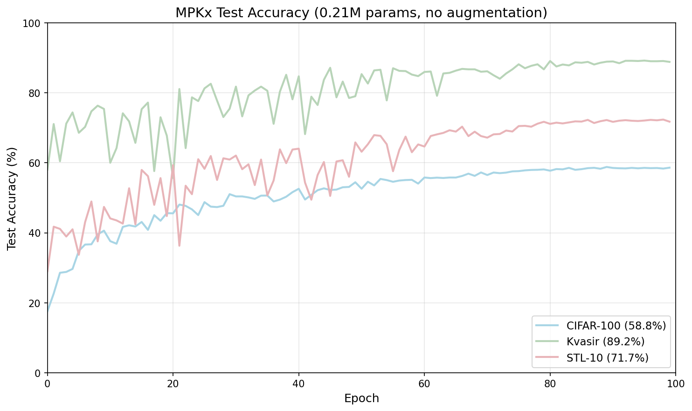
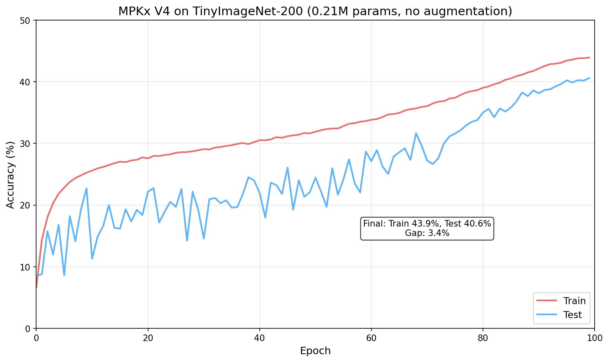
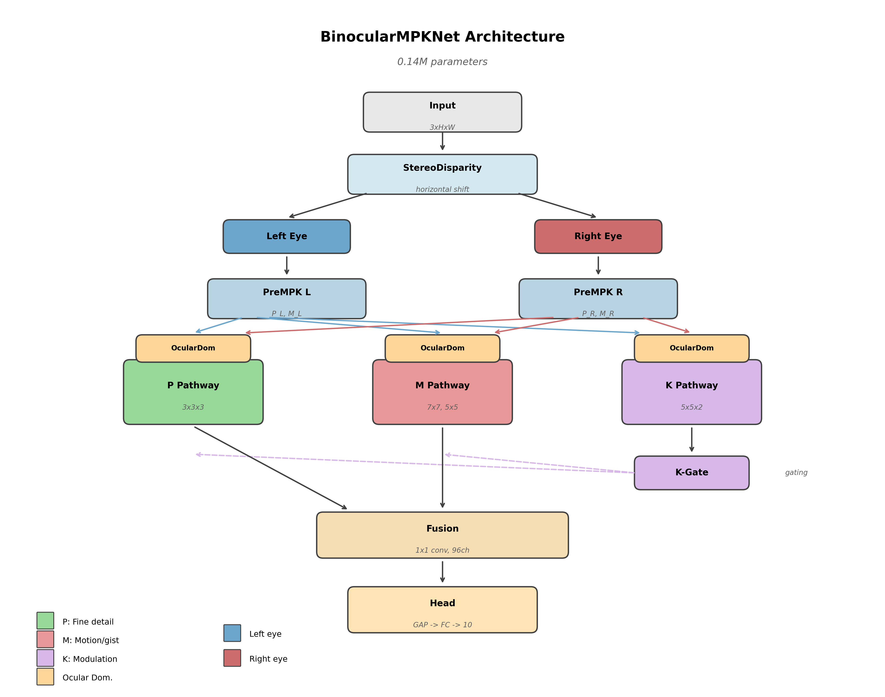

# MPKNet: A LGN-Inspired Architecture for Efficient Visual Processing

**MPKNet** is a bio-inspired convolutional neural network that models the Magnocellular (M), Parvocellular (P), and Koniocellular (K) pathways of the Lateral Geniculate Nucleus (LGN), based on cross-species evolutionary priors observed in mammals from tree shrews to primates.

---
> Contact: [djlougen.github.io](https://djlougen.github.io/PersonalWebsite/) or d.lougen@mail.utoronto.ca
---

## Efficiency Highlight

### Kvasir-v2 (Medical Endoscopy, 8 classes)

| Model | Params | Accuracy | Acc/Param | Notes |
|-------|--------|----------|-----------|-------|
| **MPKx** | **0.21M** | **89.2%** | **425** | No pretraining, no augmentation |
| MPKNet (binocular) | 0.14M | 84.1% | 601 | No pretraining, no augmentation |
| Swin Transformer | 0.40M | 74.5% | 186 | - |
| ConvMixer | 0.59M | 92.5% | 157 | - |
| Vanilla ViT | 0.77M | 79.5% | 103 | - |
| SqueezeNet | 1.25M | 85.6% | 68 | - |
| MobileNetV3-Small | 2.5M | 92.5% | 37 | - |
| DenseNet201 | 19.2M | 94.5% | 5 | - |

### MPKx (V4)

Architectural revision based on insights from V1-V3 experiments.

| Dataset | Params | FLOPS | Test Acc | Acc/Param | Train/Test Gap | Notes |
|---------|--------|-------|----------|-----------|----------------|-------|
| TinyImageNet | 0.21M | ~142M | 40.6% | 193 | 3.5% | 200 classes, 64x64, no aug |
| CIFAR-100 | 0.22M | 281M | 58.8% | 267 | 11% | |
| Kvasir | 0.21M | ~280M | 89.2% | 425 | 8% | |
| STL-10 | 0.21M | ~280M | 71.7% | 341 | 12% | |



**TinyImageNet comparison** (200 classes, 64x64):

| Model | Params | Test Acc | Acc/Param | Notes |
|-------|--------|----------|-----------|-------|
| **MPKx** | **0.21M** | **40.6%** | **193** | No augmentation, 100 epochs |
| MPKx (with aug) | 0.21M | 24.1% | 115 | Augmentation hurts performance |
| ResNet18 | 11M | 41.5% | 3.8 | 52× more params |
| MobileNetV2 | 3.4M | 33.1% | 9.7 | 16× more params |
| EfficientNet | - | 36.9% | - | |

*MPKx matches ResNet18 accuracy with 52× fewer parameters on TinyImageNet-200. Accidentally ran with augmentation on - dropped to 24%, reinforcing that augmentation interferes with the model's intrinsic invariances.*



*The train/test gap stays tight (~3.4%) throughout training despite no augmentation. The curve shape is unusual - not sure what to make of it yet, but the model isn't overfitting much even on 200 classes.*

#### Prototype-Based Retrieval (CIFAR-100)

MPKx embeddings support nearest-prototype classification without retraining:

| Evaluation | Prototype Acc | Linear Acc |
|------------|---------------|------------|
| Train (held-out 20%) | 71.2% | 88.7% |
| Test set | 49.8% | 55.8% |

*Held-out 20%: Train on 80% of training set, build class prototypes from that 80%, evaluate on remaining 20% of training set.*

The 71% prototype accuracy shows MPKx learns retrieval-ready embeddings - no retraining needed, just compute class centroids and do nearest-neighbor lookup. Useful for few-shot learning and image search.

### MPKx Summary

| Metric | Value |
|--------|-------|
| Parameters | 0.21-0.22M |
| Model size | 0.89MB |
| Embedding size | 96 floats (384 bytes) |
| FLOPs | ~142-280M (task dependent) |

**The efficiency story**: MPKx achieves 89.2% on Kvasir with 0.21M parameters, within 3.3 points of ConvMixer (92.5%) at 3× fewer parameters. On TinyImageNet-200, it matches ResNet18 (41.5%) with 52× fewer parameters and beats MobileNetV2 by 7+ points. The 96-float embeddings are 5-20× more compact than CLIP/ResNet (512-2048 floats). For resource-constrained applications (edge devices, real-time medical imaging, VLM vision encoders), this trade-off matters.

---

## Motivation

**The core hypothesis.** Performance comes from having the right regions doing the right things, and to quote Radiohead "Everything in its right place". Not from parameter count or training tricks. Biology solved vision with 20 watts because the structure itself does work.

Most "bio-inspired" approaches borrow surface-level features (Gabor filters and such) without modeling the fundamental parallel-stream architecture that evolution has conserved across mammals for 200 million years. MPKNet takes a different approach. It directly implements the laminar organization of the LGN as observed in humans and [tree shrews](https://pubmed.ncbi.nlm.nih.gov/40550685/) and macaques.

The question is **does having the right areas exist and connected in the right way cause useful behaviors to emerge without being explicitly programmed?**

This project was largely inspired by [Yamins et al. (2014)](https://www.pnas.org/doi/10.1073/pnas.1403112111) on performance-optimized hierarchical models and grew out of my PhD research on the LGN at the University of Toronto.

### The Longer Vision

The current MPKNet is just the LGN stage, it can be thought of as a early preprocessing before the primary visual cortex.  

The current roadmap is:

1. **LGN** (current). M/P/K parallel pathways ✓
2. **Retinotectal pathway**. 
3. **V1**. Orientation columns
4. **Full thalamo-cortical loops**. Testing whether attention emerges from architecture

The hypothesis is that **attention isn't the result of on set of cells or regions. It instead emerges from having the right areas connected the right way.** Transformers need attention modules because they're missing the architecture that would generate it naturally.

### Compute Democratization

This project was developed during summer 2025 in my free time at home, using my own hardware (not university resources). All experiments were run on a DGX Spark or a MacBook M3 Max. The whole point is to make this work on hardware affordable for more labs without the need for compute cluster resources.

I am open to suggestions and collaboration. I'm hoping to apply this to drones and robotics (currently 3D printing a robot arm with a camera). I also plan to explore its ability to encode visual information for a VLM.

I recognize that computers are not brains, but I'm also a wittgensteinian so I do get pedantic about semantics... I think it could argued that both are a *computer*, the difference lies in the medium/means with which it is accomplished. I also felt like this was a cool and compelling way to learn torch/AI while working on my PhD.


## Key Ideas

For a thorough explanation of the LGN and its pathways, see [Solomon (2021)](https://pubmed.ncbi.nlm.nih.gov/33832683/).

1. **Parallel Visual Streams**: Like the biological LGN, MPKNet processes visual information through two specialist pathways modulated by a third grouping of cells:
   - **Magno (M)**: Large receptive fields, fast temporal processing, global "gist"
   - **Parvo (P)**: Small receptive fields, high spatial acuity, fine detail
   - **Konio (K)**: Context relay and cross-stream modulation

2. **CellPop Retinal Sampling**: Structured downsampling using `pixel_unshuffle` to model retinal ganglion cell population responses

3. **Konio Gating**: The K-pathway generates channel attention to modulate the importance of the P and M streams, acting as a context-aware relay (novel architectural contribution)

4. **Evolutionary Priors**: Kernel sizes and strides chosen to reflect biological receptive field properties across species

5. **Late Pooling**: Pooling is deferred until the final GAP layer. This preserves spatial noise throughout the network. The hypothesis is that "what is not" (negative space, noise patterns) may carry information that aids discrimination, similar to how biological systems may use absence of signal as informative.

6. **Task Agnostic**: The goal is for the model architecture to remain unchanged regardless of task. Just like biological visual systems, you don't modify the structure, you simply give it a task and it learns.

### The Core Insight

In a standard neural network, every neuron can multiply with every other neuron in the next layer. MPKNet restricts *where* the multiplying happens: M only talks to M, P only talks to P, K modulates but doesn't mix features. The math is the same; the wiring diagram is different.

The claim is that the *pattern* of who multiplies with whom encodes something useful. Biology figured out that keeping M separate from P until later produces better representations. Late fusion isn't just "where": its "where" from the lens of a specialist stream. MPKNet seeks to recreate that information routing in the torch software.

*Its what you multiply and where you multiply.* That's the whole architecture. And yes, "what" and "where" aren't accidental words; The P pathway feeds the ventral "what" stream; the M pathway feeds the dorsal "where" stream, the architecture recapitulates the biology down to the semantics.

## Architecture


### Binocular MPKNet



The binocular variant models the eye-specific organization of the LGN:

- **Ocular dominance**: LGN layers are eye-specific (layers 1,4,6 receive contralateral input; 2,3,5 ipsilateral). BinocularMPKNet implements this with channels assigned to left/right eye processing, with graded mixing from purely monocular to fully binocular.
- **Stereo disparity**: Simulates the slight positional difference between two eyes via horizontal shifts, providing depth cues even from single images during training.
- **Separate preprocessing**: Each eye gets its own center-surround filtering before pathway processing.

The binocular architecture achieves comparable or better results with fewer parameters (0.14M vs 0.26M for base MPKNet) while adding biological plausibility.

## Quick Start

```python
from mpkSGD_kgate import MPKNet

# Create model (CIFAR-10 example)
model = MPKNet(num_classes=10, ch=48)
print(f"Parameters: {sum(p.numel() for p in model.parameters()):,}")
# Output: Parameters: 259,027

# Forward pass
import torch
x = torch.randn(1, 3, 32, 32)
out = model(x)  # [1, 10]
```

```python
from binocular_mpknet import BinocularMPKNet

# Create binocular model (STL-10 example)
model = BinocularMPKNet(num_classes=10, ch=48, use_stereo=True)
print(f"Parameters: {sum(p.numel() for p in model.parameters()):,}")
# Output: Parameters: ~140,000

# Forward pass (stereo views generated internally)
x = torch.randn(1, 3, 96, 96)
out = model(x)  # [1, 10]
```

The architecture automatically:
- Splits input into M (luminance/gist) and P (detail) streams via center-surround filtering
- Processes each through pathway-specific conv layers
- Uses K-pathway to generate attention gates for M and P
- Fuses streams for final classification

## Results

### CIFAR-10 (From Scratch, No Pretraining)

| Model | Params | Val Acc (no aug) | Val Acc (aug) | DFA | Train Acc |
|-------|--------|------------------|---------------|-----|-----------|
| MPKNet + CellPop | 0.54M | 79.5% | 81.1% | 0.52 | ~95% |
| Baseline CNN | 0.55M | 84.6% | - | - | 100% (overfits) |
| MPKNet (binocular) | 0.14M | 83.0% | - | - | ~93% |

**Preliminary Observations**:

1. **Augmentation Insensitivity**: MPKNet gains only **+1.6%** from heavy augmentation (vs +8-12% typical for CNNs). This is *consistent with the hypothesis* that the parallel M/P/K pathway structure provides intrinsic invariances, though further investigation is needed.

2. **Implicit Regularization**: While the baseline CNN achieves higher peak accuracy (84.6%), it memorizes the training set (100% train acc). MPKNet's biological structure *appears to act as* implicit regularization, preventing perfect memorization.

3. **Fractal-like Dynamics**: The models exhibit DFA ≈ 0.52, within the biological range (0.5-0.75). Whether this reflects meaningful computational properties or is an artifact of data structure remains an open question (see Fractal Dynamics section).

**Note on Evaluation**: This project explores bio-inspired design principles rather than pursuing SOTA accuracy. The value lies in understanding how biological organizational principles (parallel visual streams, cross-stream modulation) translate to computational properties in artificial systems.

### STL-10 (96x96 images, 5000 train samples)

| Model | Params | Accuracy | Notes |
|-------|--------|----------|-------|
| MPKNet (binocular) | 0.14M | 71.0% | No pretraining, no augmentation |

STL-10 is a challenging dataset with only 5000 labeled training samples. The binocular model shows reasonable generalization despite the limited data.

**Ablation Study** (Preliminary Results):

| Ablation | Best Test Acc | Train Acc | Gap | Δ from Full |
|----------|---------------|-----------|-----|-------------|
| **Full model** | **71.0%** | ~85% | ~14pt | - |
| No K-gating | 71.1% | ~80% | ~9pt | +0.1pt |
| No M pathway | 70.0% | ~81% | ~11pt | −1.0pt |
| No P pathway | 62.8% | ~71% | ~8pt | −8.2pt |

**Interpretation**: Results support the hypothesis that pathways serve distinct functions:

- **P is load-bearing** (−8.2pt): Parvocellular pathway is essential for fine spatial discrimination. Removing it severely impairs classification, consistent with P-cells' role in detail processing.

- **M carries generalizable information** (−1.0pt): Magnocellular pathway contributes real signal that transfers to test data. The moderate gap suggests M provides useful global context even on static images.

- **K-gating adds capacity that doesn't generalize on static images** (+0.1pt test, but +5pt train): K-gating increases training accuracy (~80% → ~85%) without improving test performance. This suggests K's modulatory role is optimized for dynamic/temporal contexts rather than static classification. The full model's larger train-test gap (14pt vs 9pt) indicates K adds capacity that overfits on frozen frames.

**Biological implication**: K-cells are more relevant for slow temporal tasks (e.g., data-night cycle) where context-dependent gain control matters. Think about being in the shade in an otherwise sunny surrounding, our brains dont just assume night time. Static image benchmarks may underestimate K's contribution to real visual processing.

### Channel Scaling Study (CIFAR-10)

| Config | Params | Test Acc | Train Acc | Overfitting Gap |
|--------|--------|----------|-----------|-----------------|
| ch=24 | 0.040M | 77.7% | 82.2% | 4.5% |
| **ch=48** | **0.14M** | **81.9%** | **88.0%** | **6.0%** |
| ch=64 | 0.25M | 81.2% | 88.2% | 7.0% |

**Finding**: ch=48 is optimal. Larger models (ch=64) show diminishing returns: more parameters, worse test accuracy, more overfitting.

### Extended Training (CIFAR-10, ch=48)

| Epochs | Test Acc | Train Acc | Overfitting Gap |
|--------|----------|-----------|-----------------|
| 100 | 81.9% | 88.0% | 6.0% |
| **300** | **82.1%** | **97.5%** | **15.4%** |

**Finding**: Extended training with SGD + cosine annealing yields modest improvement (+0.2%) but significantly increases overfitting. The 300-epoch model memorizes the training set while the architecture's implicit regularization prevents complete collapse on test data.

### Comparison Context

| Model | Params | CIFAR-10 | CIFAR-100 | STL-10 | TinyImageNet | Pretrained? | Augmentation |
|-------|--------|----------|-----------|--------|--------------|-------------|--------------|
| **MPKx** | 0.21M | - | 58.8% | 71.7% | **40.6%** | No | None |
| **MPKNet (binocular)** | 0.14M | 83.0% | 52.8% | 71.0% | - | No | None |
| **MPKNet (binocular)** | 0.14M | - | 46.0% | - | - | No | Heavy |
| ResNet18 | 11M | - | - | - | 41.5% | No | Standard |
| MobileNetV3-Small | 2.5M | 92.5% | 75.4% | - | - | No | Heavy |
| SqueezeNet | 1.2M | 84.5% | 58.5% | - | - | Yes (ImageNet) | Standard |

*Comparison numbers from [Benchmark Analysis of Deep Learning Models on CIFAR-10/100](https://arxiv.org/abs/2505.03303). Most published results use pretraining and/or heavy augmentation. MPKNet (binocular) results are from-scratch to isolate architectural contribution.*

**Note on CIFAR-100 augmentation**: The heavy augmentation run (46.0%) underperforms no-augmentation (52.8%). This is *hypothesis-consistent* with MPKNet's biological structure providing intrinsic invariances, though the effect warrants further investigation across datasets.

*Continuing to run on any dataset I can get - working on object detection next.*

## Fractal Dynamics

I learned about fractal dynamics from the [Sereno lab](https://www.nature.com/articles/s41599-020-00648-y) at the University of Oregon while doing my masters and was curious to explore it here. For a cool introduction to fractal dynamics, see the [Jackson Pollock-related paper](https://pmc.ncbi.nlm.nih.gov/articles/PMC3124832/) on how to know if you have a real or fake pollock painting. 

I measure Detrended Fluctuation Analysis (DFA) of prediction confidence traces during evaluation. DFA was introduced by [Peng et al. (1994)](https://journals.aps.org/pre/abstract/10.1103/PhysRevE.49.1685) and has since been applied extensively to neural signals. [Linkenkaer-Hansen et al. (2001)](https://pubmed.ncbi.nlm.nih.gov/11160408/) discovered long-range temporal correlations (LRTC) in EEG oscillations, and subsequent work suggests these correlations reflect [critical-state dynamics in neural networks](https://pmc.ncbi.nlm.nih.gov/articles/PMC3510427/).

- **DFA ≈ 0.5**: Uncorrelated noise (no long-range structure)
- **DFA > 0.5**: Long-range temporal correlations present
- **Biological range**: Typically 0.75 or higher in neural systems

The models consistently produce DFA ≈ 0.52, slightly above the uncorrelated baseline. But, thats all it is, slightly above baseline I mainly included this because I thought it would be cool. However, whether it means something is a whole other question. 


**For collaboration inquiries**, please contact me via my [website](https://djlougen.github.io/PersonalWebsite/).

## File Structure

```
mpknet/
├── mpkSGD.py           # Core MPKNet architecture (public)
├── mpkSGD_kgate.py     # MPKNet with K-gating (public)
├── cellpop.py          # CellPop retinal sampling (public)
├── modelData.py        # Dataset loading utilities (public)
├── tbLogger.py         # TensorBoard logging (public)
├── figures/            # Architecture diagrams
├── results/            # Experiment results
└── mpknet_binocular.py # Binocular version (public)
```

## Biological Motivation

MPKNet's architecture is an amalgamation of tree shrew and human LGN organization. The tree shrew (*Tupaia*) LGN provides an excellent model for studying parallel visual processing due to its clearly laminated structure, with clean separation between pathway types. This inspired the parallel-stream approach. The specific layer counts are based on human LGN anatomy:

- **Koniocellular**: 3 layers (sparse, modulatory)
- **Parvocellular**: 4 layers (color, detail)
- **Magnocellular**: 2 layers (motion, global)

This architecture is conserved across mammals, suggesting evolutionary optimization for efficient visual processing.
As for the kernels, I was choosing odd numbers as those give a center/*fovea*, however this is another area worth testing.

## What This Project Deliberately Ignores

Several biological features are intentionally omitted. The reasoning:

**Temporal dynamics / spiking**: The LGN exhibits rich temporal processing; M cells respond transiently, P cells have sustained responses. I chose to focus on the spatial/structural organization first. Adding temporal dynamics (e.g., spiking networks, LSTM-like recurrence) would complicate the architecture and I want to better understand what they do first.

**Recurrent connections**: Real visual processing involves massive feedback from V1 to LGN and lateral connections within LGN. These are omitted because feedforward CNNs are better understood and easier to train. Recurrence is a natural next step but adds training complexity. I did see a paper on [HRM](https://arxiv.org/abs/2506.21734) recently and wonder if there is a reccurence mechanism needed. 

**Foveation / eccentricity**: Biological retinas have varying resolution across the visual field. This could be added via attention mechanisms or non-uniform sampling, but would require larger images than CIFAR-10's 32x32 to be meaningful.

**Color opponent channels**: The P pathway in particular carries color opponent signals (red-green). The current implementation uses standard RGB. True color opponency might improve the biological fidelity of the P stream. However, I'm still uncertain whether opponency (outside of cones not passing to the M pathway making it concerned with changes in brightness) is fundamentally baked into our visual system or if it emerges as a quirk of [utility-based coding](https://www.sciencedirect.com/science/article/pii/S136466132300147X). 

**Cortical processing (V1+)**: This model stops at LGN-level processing, the fusion layer is a crude stand-in for V1 integration. I'm currently thinking about how to do this but need to finish a K cell related paper before properly thinking about V1.

**Attention / top-down modulation**: Beyond K-gating, biological vision involves attentional modulation from higher areas. This is ignored to keep the model simple and feedforward. However, I suspect attention may emerge as a result of the architectural constraints rather than needing explicit implementation. 

This occurred to me through my work on Inhibition of Return (IOR), the phenomenon where attention is slower to return to a previously attended location, measureable via reaction time ([Posner & Cohen, 1984](https://link.springer.com/chapter/10.1007/978-1-4612-4760-5_26)). Once you get into the literature it makes sense why IOR exists, but I do wonder:  why does the brain/visual system care? Something can happen, the system could acknowledge that area, then go back to not caring. But it doesn't; it acknowledges the location and decides its worth inhibiting that area. IOR isn't the result of any one group of cells or area; it's the culmination of different brain areas talking to each other.

## Future Directions

**Parallel pathway execution**: The M/P/K pathways are independent until V1 fusion, so I do wonder "could this be multi-threaded on a cpu?" I dont understand that stuff well enough, but would love to test/know. 

## White Paper

*Coming soon*, once I figure out how to write it!

## Citation

```bibtex
@misc{MPKNet,
  author = {Lougen, D.J.},
  title = {MPKNet: A LGN-Inspired Architecture for Efficient Visual Processing},
  year = {2025},
  publisher = {GitHub},
  url = {https://github.com/DJLougen/MPKnet}
}
```

## Acknowledgements

Thanks to my then-advisor at UO, Paul Dassonville, for telling me about these cells in the first place, and to my current advisor Jay Pratt for helping me with a forthcoming paper that redefines the role of koniocells in the LGN.

## License

Dual-licensed under MIT OR Apache-2.0 (your choice).

Patent pending (US 63/950,391).

## More About Me

[djlougen.github.io/PersonalWebsite](https://djlougen.github.io/PersonalWebsite/)


