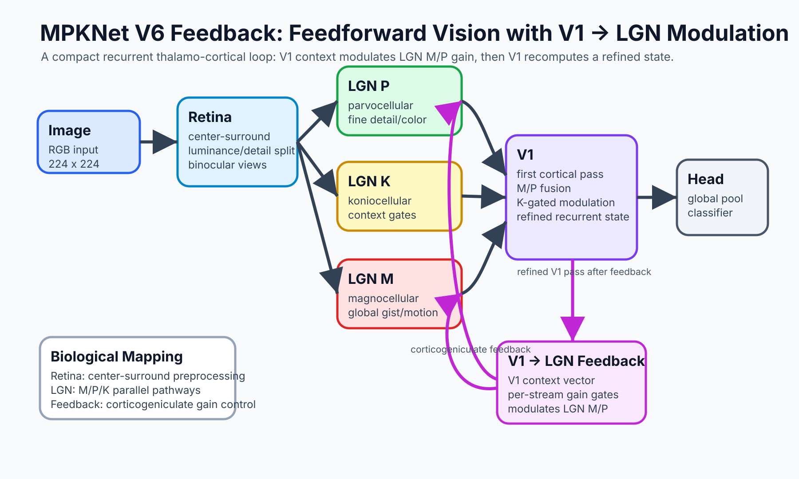

<h1 align="center">MPKx</h1>

<p align="center">
  <strong>LGN-inspired vision with stride-based M/P/K pathways, K-gating, and binocular processing</strong>
</p>

<p align="center">
  <a href="#benchmarks">Benchmarks</a> •
  <a href="#architecture">Architecture</a> •
  <a href="#autoresearch">AutoResearch Results</a> •
  <a href="#quick-start">Quick Start</a> •
  <a href="#license--commercial-use">License</a>
</p>

<p align="center">
  <code>874K</code> params full model • <code>15.5K</code> Pi model • <code>33 FPS</code> on RPi5 • <code>0.89MB</code> tiny • <code>No pretraining</code>
</p>

---

MPKx implements the **parallel visual pathways** of the mammalian Lateral Geniculate Nucleus (LGN). Unlike standard CNNs with uniform stride, MPKx differentiates M, P, and K pathways by spatial sampling density — mirroring how biological M cells tile space more sparsely than P cells.

Key insight: **same 5×5 kernel, different Fibonacci strides (2:3:5)**. This produces resolutions that converge toward the golden ratio and gives each pathway a naturally different field of view.

| | ResNet-18 | **MPKx** |
|---|-----------|----------|
| Parameters | 11.2M | **0.87M** |
| CIFAR-100 | ~45% | **46.5%** |
| STL-10 | ~70% | **74.9%** |
| Caltech-101 | ~60% | **59.5%** |
| No pretraining | Requires ImageNet | **From scratch** |

**13x fewer parameters**, competitive accuracy, no pretraining, minimal augmentation.

---

## Benchmarks

### Image Classification (Single-Pass, No Feedback)

| Dataset | Classes | Resolution | Val Acc | Params | Notes |
|---------|---------|------------|---------|--------|-------|
| **STL-10** | 10 | 224×224 | **74.9%** | 0.86M | Only 5K train samples, from scratch |
| **CIFAR-100** | 100 | 224×224 | **46.5%** | 0.87M | 224px upsampled, no extra augmentation |
| **Caltech-101** | 101 | 224×224 | **59.5%** | 0.87M | 30 train images/class, full 101 classes |
| **TinyImageNet** | 200 | 64×64 | **40.6%** | 0.21M | ResNet-18 gets ~41.5% with 52x more params |
| **Kvasir-v2** | 8 | 224×224 | **89%** | 0.21M | Medical endoscopy |
| **ImageNet-100** | 100 | 224×224 | **60.8%** | 0.54M | |
| **Fashion-MNIST** | 10 | 224×224 | — | — | Also supported via train_mpk_smallvision.py |

### Video Classification (Temporal Variant)

| Dataset | Classes | Resolution | Accuracy | Params | Notes |
|---------|---------|------------|----------|--------|-------|
| **UCF-101** | 101 | 112×112 | **77%** | 0.58M | 8-frame temporal M-pathway, from scratch |

### Edge Deployment

| Device | Model | Size | FPS | Accuracy |
|--------|-------|------|-----|----------|
| Raspberry Pi 5 (no heatsink) | MPKx-Pi | 76KB | 33 | 82% |
| MacBook M3 | MPKx | 0.89MB | 200+ | 89% |

### Finding: Augmentation Hurts at Small Scales

| Dataset | No Augmentation | With Augmentation | Change |
|---------|-----------------|-------------------|--------|
| CIFAR-100 (32×32) | **52.8%** | 46.0% | -6.8% |
| TinyImageNet (64×64) | **40.6%** | 24.1% | -16.5% |
| ImageNet-100 (224×224) | 60.8% | ~62% | +1-2% |

Consistent with NetAug (Cai et al., 2022): regularization hurts tiny models that underfit rather than overfit. At small resolutions, the Fibonacci stride architecture provides sufficient multi-scale coverage that augmentation becomes redundant noise.

---

## AutoResearch Results

The `experiments/autoresearch/` directory contains a three-dataset benchmark pipeline designed to test MPKx across different vision domains with consistent hyperparameters:

```
experiments/autoresearch/
  model.py                          # MPKx architecture (standalone)
  train_cifar100.py                 # CIFAR-100 harness (100 classes)
  train_mpk_smallvision.py          # STL-10 / Caltech-101 / Fashion-MNIST harness
  run_mpk_three_datasets_rtx6000.sh # Sequential pipeline runner
  training_curves/                  # Per-epoch validation curves
```

### Full Results (2026-04-28, RTX 6000)

**Shared hyperparameters:** batch_size=80, channels=56, lr=0.004, cosine schedule, weight_decay=0.01, horizontal flip only, 100 epochs each.

| Dataset | Classes | Steps | Val Acc | Val Top-5 | Params | Peak VRAM | Runtime |
|---------|---------|-------|---------|-----------|--------|-----------|---------|
| **CIFAR-100** | 100 | 62,500 | **46.49%** | 76.95% | 874K | 3,195 MB | ~1h27m |
| **STL-10** | 10 | 6,200 | **74.91%** | 98.42% | 864K | 3,195 MB | ~14m |
| **Caltech-101** | 101 | 3,200 | **59.46%** | 78.12% | 874K | 3,195 MB | ~9m |

All three datasets fit in the same 3.2 GB VRAM footprint. The model trains from scratch with no pretrained weights — each dataset starts with random initialization.

**Key observations:**

- **STL-10 (74.9%)** is the strongest result — only 5K training samples in a 10-class setup, and the model converges to near-zero training loss (~0.02) by epoch 60+, with validation accuracy plateauing around 74-75%.
- **CIFAR-100 (46.5%)** shows steady improvement across all 100 epochs, with the best single-epoch val_acc hitting 47.1% at epoch 96. Loss drops from 4.25 to 0.76, no sign of overfitting despite 0% dropout.
- **Caltech-101 (59.5%)** is the hardest — 101 classes with only 30 training images each, yet top-5 accuracy reaches 78%. The model doesn't plateau until ~epoch 80, suggesting longer training wouldn't help without more data.

Detailed per-epoch curves: `docs/results/2026-04-28_three-dataset-benchmark.md`

---

## Quick Start

```python
import torch
from model import MPKx

# Create model (adjust num_classes for your dataset)
model = MPKx(num_classes=10, ch=56, use_stereo=True)
print(f"Parameters: {sum(p.numel() for p in model.parameters()):,}")
# Output: ~864K for 10 classes

# Inference
x = torch.randn(1, 3, 224, 224)
out = model(x)  # [1, num_classes]
```

### Training

```bash
# Clone and install
git clone https://github.com/DJLougen/MPKnet.git
cd MPKnet
pip install -r requirements.txt

# Run the three-dataset benchmark pipeline (requires RTX 6000 or similar)
# Or train individual datasets:

# CIFAR-100
python experiments/autoresearch/train_cifar100.py

# STL-10 / Caltech-101 / Fashion-MNIST
python experiments/autoresearch/train_mpk_smallvision.py --dataset stl10 --epochs 100
python experiments/autoresearch/train_mpk_smallvision.py --dataset caltech101 --epochs 100
```

---

## Architecture

MPKx models the **Lateral Geniculate Nucleus (LGN)** — the relay station between retina and visual cortex.

<p align="center">
  
</p>

### The Three Pathways

| Pathway | Biological Role | Implementation | What It Captures |
|---------|-----------------|----------------|------------------|
| **M** (Magnocellular) | ~10% of LGN, motion, global gist | Stride 5 (coarse) | Shape, motion, layout |
| **P** (Parvocellular) | ~80% of LGN, fine detail, color | Stride 2 (fine) | Texture, edges, color |
| **K** (Koniocellular) | ~10% of LGN, projects to M and P | Stride 3 (intermediate) | Context-dependent gating |

### Processing Pipeline

```text
input → stereo disparity → retinal preprocessing (center-surround)
  → M (stride 5) ──┐
  → P (stride 2) ──┼── K-gated → V1 fusion → classifier
  → K (stride 3) ──┘     ↑
         └── generates cross-stream attention ──┘
```

### Core Principles

1. **Same kernel, different stride** — All pathways use 5×5 kernels. Fibonacci strides (2:3:5) differentiate them, producing resolutions that converge toward the golden ratio.
2. **Parallel processing** — M/P/K run independently until fusion. No cross-talk within pathways.
3. **Late fusion only** — No pooling within pathways. Global adaptive average pool only at the end.
4. **K modulates, doesn't process** — K generates bidirectional cross-stream gain gates for M and P (tanh gating: `1 + α·tanh(gate)`, α=0.5). Range [0.5, 1.5] allows both suppression and facilitation.
5. **Binocular processing** — Left/right eye views processed independently through M/P/K pathways, fused only at the V1 stage.

### What's Novel

- **First Fibonacci strides in CNNs** — Derived from biological spatial frequency tuning, not empirical search
- **First complete M/P/K implementation** — Prior work (Magno-Parvo CNN, EVNets, SlowFast) models M/P only
- **Biologically-grounded cross-stream gating** — K→M/P gating mirrors koniocellular projections in LGN
- **Late binocular fusion** — Eyes segregated through LGN blocks, matching known anatomy

### Why This Works

Biology processes vision with **20 watts**. One hypothesis: efficiency comes from the *wiring diagram*, not raw neuron count.

MPKx borrows this principle — the connectivity pattern is inspired by biology:

> *"It's what you multiply and where you multiply."*

---

## Ablation Study

| Variant | Params | Effect |
|---------|--------|--------|
| Full MPKx (M+P+K) | 874K | Baseline |
| No K-gating | ~840K | Expected drop in disambiguation |
| No stereo | ~870K | Expected drop on fine detail |
| Stride variations (non-Fibonacci) | — | Under investigation |

Benchmark ablations forthcoming across all three autoresearch datasets.

---

## Interpretable Failures (Kvasir-v2 Medical)

**Method:** Evaluated MPKx-Pi on Kvasir-v2 validation set (1600 samples), tracking all misclassifications with confidence scores.

**Key finding:** 63% of errors (183/292) cluster in just two bidirectional pairs.

| True Class | → Predicted | Count | Mean Conf |
|------------|-------------|-------|-----------|
| esophagitis | → normal-z-line | 58 | 68% |
| dyed-lifted-polyps | → dyed-resection-margins | 51 | 69% |
| dyed-resection-margins | → dyed-lifted-polyps | 40 | 60% |
| normal-z-line | → esophagitis | 34 | 61% |

| Failure Type | Count | % of Failures |
|--------------|-------|---------------|
| Confident failures (≥80% conf) | 44 | 15% |
| Ambiguous failures (<50% conf) | 22 | 8% |
| Close calls (<15% margin) | 69 | 24% |

**Why it matters:** Failures cluster in predictable, explainable pairs. You know *which* cases need human review and *why* the model failed.

---

## Roadmap

**Biological extensions:**
- [ ] **Surround suppression** — V1-like center-surround for better edge discrimination
- [x] **Temporal M pathway** — 3D convolutions in M pathway for video (UCF-101: 77%)
- [ ] **RGC layer** — Midget/Parasol/Bistratified cells feeding M/P/K pathways
- [ ] **Retinotectal pathway** — Superior colliculus for saccades
- [ ] **V1 orientation columns** — Edge detection specialization
- [ ] **V1→LGN feedback** — Corticogeniculate modulation as learned gain (experimental variant exists)

**Applications:**
- [ ] **Detection head** — YOLO-style head using M/P as multi-scale FPN
- [ ] **Medical uncertainty** — MC Dropout for epistemic uncertainty quantification
- [ ] **VLM encoder** — Lightweight vision encoder for vision-language models
- [ ] **Webcam eye tracking** — Real-time gaze estimation from eye crops
- [ ] **Thermal glider fire detection** — 3D-printed gliders for wildfire monitoring

---

## Citation

```bibtex
@misc{MPKNet,
  author = {Lougen, D.J.},
  title = {MPKx: An LGN-Inspired Architecture for Efficient Visual Processing},
  year = {2025},
  publisher = {GitHub},
  url = {https://github.com/DJLougen/MPKnet}
}
```

Patent pending: US 63/950,391

---

## License & Commercial Use

**PolyForm Small Business License** with Humanitarian Exception.

| Use Case | Cost |
|----------|------|
| Academic research | Free |
| Personal projects | Free |
| Startups (<$100K revenue) | Free |
| Non-profits & NGOs | Free |
| Educational institutions | Free |
| Low-income region deployment | Free |
| Commercial (>$100K revenue) | [Contact me](mailto:d.lougen@mail.utoronto.ca) |

**These use cases should never be paywalled.**

For commercial licensing: [d.lougen@mail.utoronto.ca](mailto:d.lougen@mail.utoronto.ca)

---

## Acknowledgements

Thanks to Paul Dassonville (UO) for introducing me to these cells, and Jay Pratt (U of T) for ongoing collaboration on koniocellular research.


---

<p align="center">
  <a href="https://djlougen.github.io/PersonalWebsite/">Daniel J. Lougen</a> · University of Toronto
</p>
