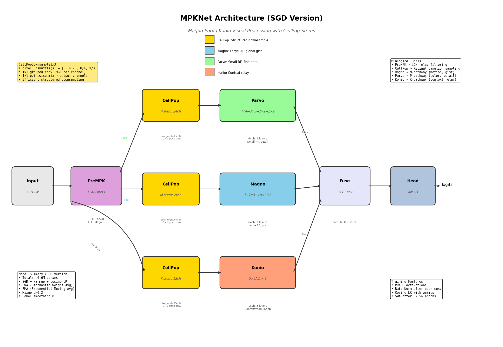

# MPKNet: A LGN-Inspired Architecture for Efficient Visual Processing

**MPKNet** is a bio-inspired convolutional neural network that models the Magnocellular (M), Parvocellular (P), and Koniocellular (K) pathways of the Lateral Geniculate Nucleus (LGN), based on cross-species evolutionary priors observed in mammals from tree shrews to primates.

---

> **Status: Exploratory / Preprint Companion**
>
> **What's public now:** Architecture diagrams, benchmark results, supporting utilities, core MPKNet implementation
>
> **What's in development:** Binocular extension (private until publication)
>
> **Feedback welcome:** Conceptual critique, robustness evaluation ideas, collaboration inquiries
>
> Contact: [djlougen.github.io](https://djlougen.github.io/PersonalWebsite/)

---

## Efficiency Highlight

### Kvasir-v2 (Medical Endoscopy, 8 classes)

| Model | Params | Accuracy | Param Ratio | Notes |
|-------|--------|----------|-------------|-------|
| **BinocularMPKNet** | **0.14M** | **84.1%** | **1×** | No pretraining, no augmentation |
| Swin Transformer | 0.40M | 74.5% | 3× | - |
| ConvMixer | 0.59M | 92.5% | 4× | - |
| Vanilla ViT | 0.77M | 79.5% | 6× | - |
| SqueezeNet | 1.25M | 85.6% | 9× | - |
| MobileNetV3-Small | 2.5M | 92.5% | 18× | - |
| MobileNetV2 | 3.5M | 83.0% | 25× | - |
| DenseNet201 | 19.2M | 94.5% | 137× | - |

**The efficiency story**: BinocularMPKNet achieves 84.1% accuracy with 0.14M parameters. MobileNetV3-Small needs 18× more parameters (2.5M) to reach 92.5%—an 8.4 percentage point gain for 18× the cost. DenseNet201 requires 137× more parameters for just 10.4 points. For resource-constrained applications (edge devices, real-time medical imaging), this trade-off matters.

---

## Motivation

**The core hypothesis:** Current vision models require massive compute because they brute-force the problem. Biology solved vision with 20 watts. What if the answer isn't more parameters—it's better architecture?

This project explores whether the organizational principles of biological visual systems can provide computational benefits that brute-force scaling cannot. The goal is not to beat SOTA on benchmarks, but to match performance *per parameter* and *per training sample*—making vision research accessible to labs without datacenter budgets.

### Why Biology?

Most "bio-inspired" approaches borrow surface-level features (Gabor filters, etc.) without modeling the fundamental parallel-stream architecture that evolution has conserved across mammals for 200 million years. MPKNet takes a different approach: directly implementing the laminar organization of the LGN as observed in humans, [tree shrews](https://pubmed.ncbi.nlm.nih.gov/40550685/), and macaques.

The question isn't "can we copy biology?" but rather: **does the architecture that evolution converged on have computational properties that emerge from structure rather than scale?**

### The Longer Vision

The current MPKNet is just the LGN stage—essentially the thalamic preprocessing before visual cortex. The roadmap:

1. **LGN** (current): M/P/K parallel pathways with binocular processing ✓
2. **Retinotectal pathway**: Superior colliculus for fast, coarse spatial processing
3. **V1**: Orientation columns, simple/complex cells, feedback to LGN
4. **Pulvinar**: Thalamic hub connecting SC, V1, and higher areas
5. **Full thalamo-cortical loops**: Testing whether attention emerges from architecture

The hypothesis driving this work: **attention isn't a mechanism you bolt on—it's an emergent property of recurrent thalamo-cortical loops.** If true, transformers need attention modules because they're missing the architecture that generates it.

### Compute Democratization

All experiments in this repo were run on a single desktop GPU (DGX Spark). If the structural approach works, it means:

- Meaningful vision research without cluster access
- Edge deployment on real hardware constraints
- Reproducibility for any lab, anywhere

This project was largely inspired by [Yamins et al. (2014)](https://www.pnas.org/doi/10.1073/pnas.1403112111) on performance-optimized hierarchical models, and grew out of my PhD research on the LGN at the University of Toronto.

I am open to suggestions and collaboration. I'm hoping to apply this to drones and robotics (currently 3D printing a robot arm with a camera). I also plan to explore its ability to encode visual information for a VLM.

To be clear: I recognize that computers are not brains. But I'm curious whether the structure that brains converged on has something to teach us about efficient computation.

## Key Ideas

For a thorough explanation of the LGN and its pathways, see [Solomon (2021)](https://pubmed.ncbi.nlm.nih.gov/33832683/).

1. **Parallel Visual Streams**: Like the biological LGN, MPKNet processes visual information through three parallel pathways:
   - **Magno (M)**: Large receptive fields, fast temporal processing, global "gist"
   - **Parvo (P)**: Small receptive fields, high spatial acuity, fine detail
   - **Konio (K)**: Context relay and cross-stream modulation

2. **CellPop Retinal Sampling**: Structured downsampling using `pixel_unshuffle` to model retinal ganglion cell population responses

3. **Konio Gating**: The K-pathway generates channel attention to modulate P and M streams, acting as a context-aware relay (novel architectural contribution)

4. **Evolutionary Priors**: Kernel sizes and strides chosen to reflect biological receptive field properties across species

5. **Late Pooling**: Pooling is deferred until the final GAP layer. This preserves spatial noise throughout the network. The hypothesis is that "what is not" (negative space, noise patterns) may carry information that aids discrimination, similar to how biological systems may use absence of signal as informative.

6. **Task Agnostic**: The goal is for the model architecture to remain unchanged regardless of task. Just like biological visual systems, you don't modify the structure, you simply give it a task and it learns.

## Architecture



## Quick Start

```python
from mpkSGD_kgate import MPKNet

# Create model (CIFAR-10 example)
model = MPKNet(num_classes=10, ch=48)
print(f"Parameters: {sum(p.numel() for p in model.parameters()):,}")
# Output: Parameters: 259,027

# Forward pass
import torch
x = torch.randn(1, 3, 32, 32)
out = model(x)  # [1, 10]
```

The architecture automatically:
- Splits input into M (luminance/gist) and P (detail) streams via center-surround filtering
- Processes each through pathway-specific conv layers
- Uses K-pathway to generate attention gates for M and P
- Fuses streams for final classification

## Results

### CIFAR-10 (From Scratch, No Pretraining)

| Model | Params | Val Acc (no aug) | Val Acc (aug) | DFA | Train Acc |
|-------|--------|------------------|---------------|-----|-----------|
| MPKNet + CellPop | 0.54M | 79.5% | 81.1% | 0.52 | ~95% |
| Baseline CNN | 0.55M | 84.6% | - | - | 100% (overfits) |
| MPKNet + Binocular | 0.14M | 83.0% | - | - | ~93% |

**Preliminary Observations**:

1. **Augmentation Insensitivity**: MPKNet gains only **+1.6%** from heavy augmentation (vs +8-12% typical for CNNs). This is *consistent with the hypothesis* that the parallel M/P/K pathway structure provides intrinsic invariances, though further investigation is needed.

2. **Implicit Regularization**: While the baseline CNN achieves higher peak accuracy (84.6%), it memorizes the training set (100% train acc). MPKNet's biological structure *appears to act as* implicit regularization, preventing perfect memorization.

3. **Fractal-like Dynamics**: The models exhibit DFA ≈ 0.52, within the biological range (0.5-0.75). Whether this reflects meaningful computational properties or is an artifact of data structure remains an open question (see Fractal Dynamics section).

**Note on Evaluation**: This project explores bio-inspired design principles rather than pursuing SOTA accuracy. The value lies in understanding how biological organizational principles (parallel visual streams, cross-stream modulation) translate to computational properties in artificial systems.

### STL-10 (96x96 images, 5000 train samples)

| Model | Params | Accuracy | Notes |
|-------|--------|----------|-------|
| **BinocularMPKNet** | **0.14M** | **71.0%** | No pretraining, no augmentation |

STL-10 is a challenging dataset with only 5000 labeled training samples. The model shows reasonable generalization despite the limited data.

**Ablation Study** (Preliminary Results):

| Ablation | Best Test Acc | Train Acc | Gap | Δ from Full |
|----------|---------------|-----------|-----|-------------|
| **Full model** | **71.0%** | ~85% | ~14pt | — |
| No K-gating | 71.1% | ~80% | ~9pt | +0.1pt |
| No M pathway | 70.0% | ~81% | ~11pt | −1.0pt |
| No P pathway | 62.8% | ~71% | ~8pt | −8.2pt |

**Interpretation**: Results support the hypothesis that pathways serve distinct functions:

- **P is load-bearing** (−8.2pt): Parvocellular pathway is essential for fine spatial discrimination. Removing it severely impairs classification, consistent with P-cells' role in detail processing.

- **M carries generalizable information** (−1.0pt): Magnocellular pathway contributes real signal that transfers to test data. The moderate gap suggests M provides useful global context even on static images.

- **K-gating adds capacity that doesn't generalize on static images** (+0.1pt test, but +5pt train): K-gating increases training accuracy (~80% → ~85%) without improving test performance. This suggests K's modulatory role is optimized for dynamic/temporal contexts rather than static classification. The full model's larger train-test gap (14pt vs 9pt) indicates K adds capacity that overfits on frozen frames.

**Biological implication**: K-cells may be more relevant for temporal tasks (e.g., second-order motion, slow isoluminant chromatic changes) where context-dependent gain control matters. Static image benchmarks may underestimate K's contribution to real visual processing.

### Channel Scaling Study (CIFAR-10)

| Config | Params | Test Acc | Train Acc | Overfitting Gap |
|--------|--------|----------|-----------|-----------------|
| ch=24 | 0.040M | 77.7% | 82.2% | 4.5% |
| **ch=48** | **0.14M** | **81.9%** | **88.0%** | **6.0%** |
| ch=64 | 0.25M | 81.2% | 88.2% | 7.0% |

**Finding**: ch=48 is optimal. Larger models (ch=64) show diminishing returns—more parameters, worse test accuracy, more overfitting.

### Extended Training (CIFAR-10, ch=48)

| Epochs | Test Acc | Train Acc | Overfitting Gap |
|--------|----------|-----------|-----------------|
| 100 | 81.9% | 88.0% | 6.0% |
| **300** | **82.1%** | **97.5%** | **15.4%** |

**Finding**: Extended training with SGD + cosine annealing yields modest improvement (+0.2%) but significantly increases overfitting. The 300-epoch model memorizes the training set while the architecture's implicit regularization prevents complete collapse on test data.

### Comparison Context

| Model | Params | CIFAR-10 | CIFAR-100 | STL-10 | Pretrained? | Augmentation |
|-------|--------|----------|-----------|--------|-------------|--------------|
| **BinocularMPKNet** | 0.14M | 83.0% | 52.8% | 71.0% | No | None |
| **BinocularMPKNet** | 0.14M | - | 46.0% | - | No | Heavy |
| MobileNetV3-Small | 2.5M | 92.5% | 75.4% | - | No | Heavy |
| SqueezeNet | 1.2M | 84.5% | 58.5% | - | Yes (ImageNet) | Standard |

*Comparison numbers from [Benchmark Analysis of Deep Learning Models on CIFAR-10/100](https://arxiv.org/abs/2505.03303). Most published results use pretraining and/or heavy augmentation. BinocularMPKNet results are from-scratch to isolate architectural contribution.*

**Note on CIFAR-100 augmentation**: The heavy augmentation run (46.0%) underperforms no-augmentation (52.8%). This is *hypothesis-consistent* with MPKNet's biological structure providing intrinsic invariances, though the effect warrants further investigation across datasets.

*Continuing to run on any dataset I can get - working on object detection next.*

## Fractal Dynamics

I learned about fractal dynamics from the [Sereno lab](https://www.nature.com/articles/s41599-020-00648-y) at the University of Oregon while doing my masters and was curious to explore it here. For a cool introduction to fractal dynamics, see [this Jackson Pollock-related paper](https://pmc.ncbi.nlm.nih.gov/articles/PMC3124832/).

I measure Detrended Fluctuation Analysis (DFA) of prediction confidence traces during evaluation. DFA was introduced by [Peng et al. (1994)](https://journals.aps.org/pre/abstract/10.1103/PhysRevE.49.1685) and has since been applied extensively to neural signals. [Linkenkaer-Hansen et al. (2001)](https://pubmed.ncbi.nlm.nih.gov/11160408/) discovered long-range temporal correlations (LRTC) in EEG oscillations, and subsequent work suggests these correlations reflect [critical-state dynamics in neural networks](https://pmc.ncbi.nlm.nih.gov/articles/PMC3510427/).

- **DFA ≈ 0.5**: Uncorrelated noise (no long-range structure)
- **DFA > 0.5**: Long-range temporal correlations present
- **Biological range**: Typically 0.5–0.75 in neural systems, with ~60% of variance attributable to genetic factors

The models consistently produce DFA ≈ 0.52, slightly above the uncorrelated baseline. I mainly included this because I thought it would be cool to track—whether it reflects meaningful computational properties or is an artifact of data structure remains an open question.

## Code Availability

The core MPKNet architecture is now public:
- `mpkSGD.py` - Base MPKNet implementation
- `mpkSGD_kgate.py` - MPKNet with K-gating (recommended)
- `cellpop.py` - CellPop retinal sampling

The binocular extension (`mpknet_binocular.py`) will be released upon paper publication.

**For collaboration inquiries**, please contact me via my [website](https://djlougen.github.io/PersonalWebsite/).

## File Structure

```
mpknet/
├── mpkSGD.py           # Core MPKNet architecture (public)
├── mpkSGD_kgate.py     # MPKNet with K-gating (public)
├── cellpop.py          # CellPop retinal sampling (public)
├── modelData.py        # Dataset loading utilities (public)
├── tbLogger.py         # TensorBoard logging (public)
├── figures/            # Architecture diagrams
├── results/            # Experiment results
└── mpknet_binocular.py # [PRIVATE] Binocular extension - available upon publication
```

## Biological Motivation

MPKNet's architecture is an amalgamation of tree shrew and human LGN organization. The tree shrew (*Tupaia*) LGN provides an excellent model for studying parallel visual processing due to its clearly laminated structure, with clean separation between pathway types. This inspired the parallel-stream approach. The specific layer counts are based on human LGN anatomy:

- **Koniocellular**: 3 layers (sparse, modulatory)
- **Parvocellular**: 4 layers (color, detail)
- **Magnocellular**: 2 layers (motion, global)

This architecture is conserved across mammals, suggesting evolutionary optimization for efficient visual processing.

## Current Focus: Binocular Processing

The binocular extension is the current active development focus. *Code and architecture diagram will be released upon publication; preliminary results are provided for feedback.*

This extension adds:

- **Ocular dominance organization**: Channels are assigned to left/right eye with graded mixing; some purely monocular, some binocular
- **Stereo disparity simulation**: Horizontal shifts between eye views during training
- **Eye-specific LGN layers**: Modeling the contralateral/ipsilateral layer organization

The binocular model is significantly smaller (0.14M params) while adding biologically plausible dual-eye processing.

## What This Project Deliberately Ignores

Several biological features are intentionally omitted. The reasoning:

**Temporal dynamics / spiking**: The LGN exhibits rich temporal processing; M cells respond transiently, P cells have sustained responses. I chose to focus on the spatial/structural organization first. Adding temporal dynamics (e.g., spiking networks, LSTM-like recurrence) would complicate the architecture before validating that the parallel stream structure itself provides value.

**Recurrent connections**: Real visual processing involves massive feedback from V1 to LGN and lateral connections within LGN. These are omitted because feedforward CNNs are better understood and easier to train. Recurrence is a natural next step but adds training complexity. See [arXiv:2506.21734](https://arxiv.org/abs/2506.21734) for a potentially relevant approach.

**Foveation / eccentricity**: Biological retinas have varying resolution across the visual field. This could be added via attention mechanisms or non-uniform sampling, but would require larger images than CIFAR-10's 32x32 to be meaningful.

**Color opponent channels**: The P pathway in particular carries color opponent signals (red-green, blue-yellow). The current implementation uses standard RGB. True color opponency might improve the biological fidelity of the P stream. However, I'm still uncertain whether opponency is fundamentally baked into our visual system or if it emerges as a quirk of [utility-based coding](https://www.sciencedirect.com/science/article/pii/S136466132300147X).

**Cortical processing (V1+)**: This model stops at LGN-level processing. Real vision involves extensive cortical computation. The fusion layer is a crude stand-in for V1 integration. A proper V1 model with orientation columns and complex cells would be a substantial extension.

**Attention / top-down modulation**: Beyond K-gating, biological vision involves attentional modulation from higher areas. This is ignored to keep the model simple and feedforward. However, I suspect attention may emerge as a result of the architectural constraints rather than needing explicit implementation. This occurred to me through my work on Inhibition of Return (IOR), the phenomenon where attention is slower to return to a previously attended location ([Posner & Cohen, 1984](https://link.springer.com/chapter/10.1007/978-1-4612-4760-5_26)). Once you get into the literature it makes sense why IOR exists, but I simultaneously hold the question: why would the visual system care? Something can happen, the system could acknowledge that area, then go back to not caring. But it doesn't; it acknowledges the location and then immediately inhibits that area. IOR isn't the result of any one group of cells or area; it's the culmination of the retinotectal, LGN, and V1 areas talking to each other.

The philosophy is to start with the most fundamental structural feature (parallel M/P/K streams) and validate that before adding complexity. Each ignored feature represents a potential future direction.

## White Paper

*Coming soon*, once I figure out how to write it!

## Citation

```bibtex
@misc{MPKNet,
  author = {Lougen, D.J.},
  title = {MPKNet: A LGN-Inspired Architecture for Efficient Visual Processing},
  year = {2025},
  publisher = {GitHub},
  url = {https://github.com/DJLougen/MPKnet}
}
```

## Acknowledgements

Thanks to my then-advisor at UO, Paul Dassonville, for telling me about these cells in the first place, and to my current advisor Jay Pratt for helping me with a forthcoming paper that redefines the role of koniocells in the LGN.

## License

Dual-licensed under MIT OR Apache-2.0 (your choice).

Patent pending (US 63/950,391).

## More About Me

[djlougen.github.io/PersonalWebsite](https://djlougen.github.io/PersonalWebsite/)


