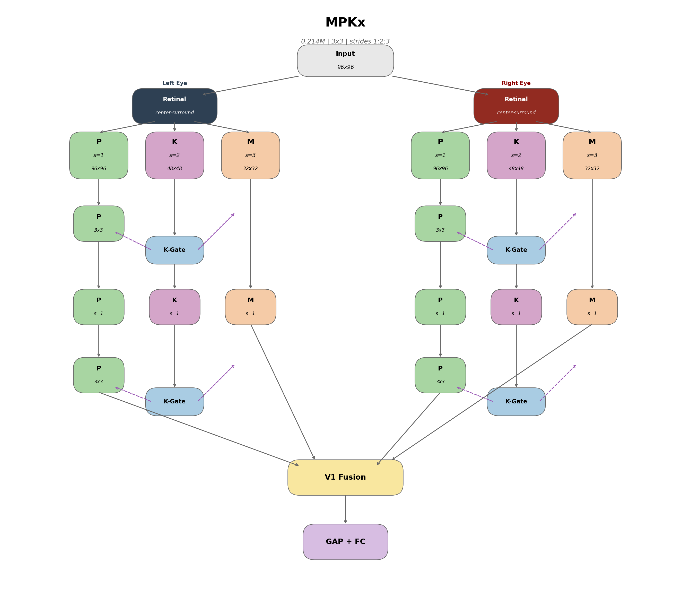

# MPKx: An Interpretable, LGN-Inspired Architecture for Efficient Visual Processing

**Daniel J. Lougen**
University of Toronto
d.lougen@mail.utoronto.ca

---

## Abstract

I present MPKx, a biologically-inspired convolutional neural network that models the parallel processing streams of the Lateral Geniculate Nucleus (LGN). Unlike conventional "bio-inspired" approaches that borrow surface-level features such as Gabor filters and use pre-built backends, MPKx directly implements the laminar organization observed across mammalian visual systems: Magnocellular (M), Parvocellular (P), and Koniocellular (K) pathways as separate processing streams with distinct spatial sampling densities. Crucially, every architectural component maps to known neuroscience; each pathway, gate, and fusion point can be explained in terms of what biological structures do and why evolution preserved them. This interpretability contrasts with attention mechanisms like squeeze-and-excitation (Hu et al., 2018), which were discovered through architecture search and explained post-hoc. The architecture achieves 40.6% accuracy on TinyImageNet-200 with only 0.23M parameters at 2.5 minutes per epoch, matching ResNet18 (41.5%) with 48x fewer parameters. On medical imaging (Kvasir-v2), it achieves 89.2% with no pretraining or augmentation, outperforming SqueezeNet (85.6%) with 6x fewer parameters. Notably, data augmentation degrades performance (40.6% to 24.1% on TinyImageNet), suggesting the architecture provides intrinsic invariances that external augmentation disrupts. Beyond benchmark performance, MPKx demonstrates that biology-first design can yield architectures that are simultaneously efficient, competitive, and interpretable, properties that have implications for medical imaging, edge deployment, and AI safety where black-box models are inadequate. This work was conducted independently during summer 2025 on consumer hardware at home, demonstrating that efficient architectures enable meaningful research without large compute clusters, and that meaningful architectural research is possible without them.

---

## 1. Introduction

This work grew out of my PhD research on the LGN at the University of Toronto. After reading a few LGN-inspired AI papers, I wanted to learn computer vision, and what started as a summer side project became this architecture.

The mammalian visual system processes information through parallel pathways before integration in primary visual cortex (V1). The Lateral Geniculate Nucleus (LGN), positioned between the retina and V1, contains three distinct cell populations that have been conserved across 200 million years of mammalian evolution.

Retinal ganglion cells project to the LGN in an organized fashion, establishing three parallel processing streams (Solomon, 2021):

- **Parvocellular (P) cells**: Comprising roughly 80% of LGN neurons, the P pathway conveys a filtered version of the retinal image optimized for high spatial acuity and red-green color vision. P cells have small receptive fields and sustained responses, making them ideal for fine detail and form perception.

- **Magnocellular (M) cells**: Approximately 10% of LGN neurons, the M pathway is optimized for achromatic visual sensitivity and motion vision. M cells have large receptive fields and fast, transient temporal responses, providing global spatial structure and sensitivity to low contrast.

- **Koniocellular (K) cells**: The remaining 10% form heterogeneous K pathways with functional properties more complex than M or P, integrating retinal with non-retinal inputs, including signals from the superior colliculus, and providing an early site of binocular convergence. Critically, K pathways project to both M and P layers in the LGN, to cytochrome oxidase blobs in V1, and can send signals directly to extrastriate cortex.

This parallel organization is remarkably consistent from tree shrews to humans (Conley et al., 1984), suggesting evolutionary optimization for efficient visual processing. For a thorough review of these pathways and their functional properties, see Solomon (2021).

Yamins et al. (2014) showed that hierarchical neural networks optimized for object categorization, without any constraints to match neural data, nonetheless predict spiking responses in V4 and IT cortex. Their interpretation: performance optimization under biological constraints produces representations that converge toward those found in actual visual cortex. MPKx extends this logic backward in the visual hierarchy. If task-optimized networks naturally develop V4/IT-like representations at their output, what happens when we constrain the input architecture to match the LGN? Rather than treating early vision as a generic feature extractor, MPKx implements the M/P/K pathway segregation that the biological system maintains from retina through to V1.

Most "bio-inspired" neural networks incorporate isolated biological motifs: Gabor filters, center-surround receptive fields, or lateral inhibition. These are plausible components, but they ignore the global organization. The LGN does not simply filter the retinal image; it routes information through parallel channels that remain segregated across multiple synapses before converging in V1. In a standard convolutional network, all features at one layer can influence all features at the next. MPKx enforces pathway segregation: M projections remain within the M stream, P within P, and K provides modulatory input to both without mixing feature representations. The computations are standard convolutions and multiplications; the connectivity pattern is not.

The hypothesis is that this routing pattern is itself a form of inductive bias. Evolution maintained parallel channels at multiple stages despite the metabolic cost: two eyes for depth perception, M/P/K segregation in the LGN, and dorsal/ventral stream separation in cortex. This repeated pattern suggests parallel specialist processing confers representational advantages that a fully-connected architecture would not discover through optimization alone. MPKx tests whether artificial systems inherit these advantages when given the same wiring constraints.

---

## 2. Architecture Evolution

The current MPKx architecture emerged through iterative refinement. Each version tested different hypotheses about how to translate biological principles into computational structures.

### V1: Kernel-Based Differentiation

The initial approach used different kernel sizes to model pathway differences:
- P pathway: 3x3 kernels (fine detail)
- K pathway: 5x5 kernels (intermediate)
- M pathway: 7x7 kernels (global gist)

This captured the intuition that M cells have larger receptive fields, but it conflated receptive field size with sampling density.

### V2: Binocular Processing

V2 added eye-specific processing to model the laminar organization of the LGN. In the biological LGN, different layers receive input from different eyes (layers 1, 4, 6 receive contralateral input; layers 2, 3, 5 receive ipsilateral input). This version introduced stereo disparity simulation and eye segregation through processing, with fusion only at the V1 stage.

### V3: K-Gating Mechanism

The koniocellular gating mechanism was present from the beginning; V3 refined how and where it was applied. The tree shrew LGN has two distinct K layers (L3 and L6) that are anatomically and molecularly distinct from the M/P layers, receiving input exclusively from small retinal ganglion cells and the superior colliculus (Sciaccotta et al., 2025). Recent work has also isolated the K pathway's contribution to aversive learning in human visual cortex, demonstrating its functional independence from M and P streams (McCain et al., 2025). This organization inspired the use of two K-gating blocks: one after the first processing stage, one after the second. The K pathway generates attention gates that modulate both M and P streams, modeling K-cells' role in cross-stream modulation and context-dependent gain control.

### V4 (MPKx): Stride-Based Differentiation

The key insight of V4 is that M, P, and K pathways differ primarily in their spatial sampling density, not kernel shape. Biologically, M cells tile the retina more sparsely than P cells. I implement this through stride:

- P pathway: stride=1 (dense sampling, fine detail)
- K pathway: stride=2 (intermediate density)
- M pathway: stride=3 (sparse sampling, global gist)

All pathways now use identical 3x3 kernels. This eliminates mid-network pooling; pathways maintain their natural resolutions until V1 fusion, with only Global Average Pooling (GAP) at the classification head.

---

## 3. Architecture

### Full Architecture



*Figure 1. MPKx architecture showing binocular processing with M, P, and K pathways. Eye segregation persists through LGN blocks, with fusion only at V1.*

### Retinal Preprocessing

Each eye stream begins with center-surround filtering to simulate retinal ganglion cell responses:

```
P = I - blur(I)     (high-pass, detail)
M = blur(luminance) (low-pass, gist)
```

Before visual information reaches the LGN, retinal ganglion cells perform a fundamental transformation: they compute local contrast rather than absolute luminance. This is achieved through center-surround receptive fields, where ON-center cells respond to bright spots on dark backgrounds and OFF-center cells respond to the inverse. Computationally, this operation is equivalent to a difference-of-Gaussians, acting as a bandpass filter that emphasizes edges and textures while discarding uniform regions.

In MPKx, a Gaussian blur (σ=1.0) approximates the inhibitory surround. Subtracting the blurred image from the original yields the center-surround response, which feeds the P stream (high-pass: edges, fine spatial detail). The M stream receives the blurred luminance directly (low-pass: global structure, coarse spatial frequencies). This preprocessing is parameter-free, adding no learnable weights, yet provides the architectural separation that allows M and P pathways to specialize from the first layer.

### K-Gating Mechanism

The K pathway generates channel attention gates that modulate both M and P streams:

```
gate_M = sigmoid(W_M * GAP(K))
gate_P = sigmoid(W_P * GAP(K))
M = M * gate_M
P = P * gate_P
```

Koniocellular neurons occupy a unique position in the LGN: they project to both M and P layers, receive input from short-wavelength (blue) cones and the superior colliculus, and comprise only ~10% of LGN neurons. K cells also project directly to extrastriate cortex, bypassing V1 entirely, and can send signals to the pulvinar and other thalamic nuclei. This broad connectivity suggests a modulatory and integrative role rather than direct feature transmission. K cells appear to provide contextual information that adjusts the relative importance of the M and P streams based on scene content, essentially acting as a gain control system.

MPKx implements this through channel-wise gating. Global Average Pooling collapses the K pathway's spatial dimensions into a context vector that summarizes "what kind of scene is this." Learned linear projections transform this context into multiplicative gates for M and P features. The operations (global pooling, linear projection, sigmoid, multiply) mirror squeeze-and-excitation (SE) attention (Hu et al., 2018). The critical difference is structural: SE blocks recalibrate a pathway's own channels, whereas K-gating has one pathway (K) modulate *other* pathways (M and P). This cross-stream architecture emerges directly from biology rather than architectural search; cross-stream modulation is one of the heterogeneous functions K cells perform.

One open question remains: K cells are notoriously noisy and heterogeneous, which raises the question of whether sigmoid is the optimal activation. A noisier or more stochastic gating mechanism might better capture K-cell behavior. Additionally, K-gating may play a larger role when provided with feedback signals from higher visual areas, but testing this requires implementing the thalamo-cortical loops planned for future versions.

### Model Summary

| Component | Details |
|-----------|---------|
| **Retinal** | Center-surround filtering per eye (Left/Right) |
| **P pathway** | stride=1, 96×96 → two 3×3 conv layers per block |
| **K pathway** | stride=2, 48×48 → one 3×3 conv layer per block |
| **M pathway** | stride=3, 32×32 → one 3×3 conv layer per block |
| **K-Gates** | 2 per eye (after block 1 and block 2) |
| **V1 Fusion** | 1×1 conv combining all 4 streams (M_L, M_R, P_L, P_R) |
| **Classifier** | Global Average Pooling → FC |

#### Component Details

**Retinal Preprocessing**: Models the center-surround receptive fields of retinal ganglion cells. In biology, this filtering occurs before information reaches the LGN, separating local contrast (edges, textures) from global luminance. Each eye receives its own preprocessing to maintain binocular segregation.

**P Pathway (Parvocellular)**: Dense spatial sampling (stride=1) preserves fine detail. Biologically, P cells comprise ~80% of LGN neurons in primates and have small receptive fields optimized for spatial acuity and color. Two convolutional layers per block allow hierarchical feature extraction while maintaining resolution.

**K Pathway (Koniocellular)**: Intermediate sampling (stride=2) at half resolution. K cells are evolutionarily older, sparse (~10% of LGN), and heterogeneous. Their primary role appears to be cross-stream modulation rather than direct feature extraction, which motivates using K primarily for gating rather than contributing features to V1 fusion.

**M Pathway (Magnocellular)**: Sparse sampling (stride=3) captures global structure. M cells (~10% of LGN) have large receptive fields and fast temporal responses, optimized for motion and low-contrast stimuli. The coarse spatial resolution reflects their role in providing "gist" rather than detail.

**K-Gates**: Implements gain control inspired by K-cell projections to both M and P layers. Two gates per eye (after each block) allow progressive context-dependent modulation. The tree shrew has two distinct K layers, which motivated this dual-gate structure.

**V1 Fusion**: Combines all four streams (M_left, M_right, P_left, P_right) with a 1×1 convolution. This models V1's role as the first cortical area where M and P streams converge and where binocular integration occurs.

**Classifier**: Global Average Pooling eliminates spatial dimensions before the final fully-connected layer. No pooling occurs within the pathways; each maintains its natural resolution until V1 fusion.

| Metric | Value |
|--------|-------|
| Parameters | 0.21-0.23M (varies by task) |
| Model size | 0.89MB |
| Embedding size | 96 floats (384 bytes) |
| FLOPs | ~142-280M (task dependent) |

---

## 4. Experiments

All experiments were conducted locally on a DGX Spark and/or MacBook M3 Max, using personal hardware. Models were trained from scratch without pretraining, transfer learning, or augmentation. Part of the motivation for using classification datasets is that classification is trivial for humans; a biologically inspired system should demonstrate that it decodes images well enough to do this. Giving the model images without augmentation and asking "what is this" seemed natural; the model only sees what I can see, and augmentation does not really exist in biological vision, except for rotations and flips. For real world applications, a system never sees augmented data; it just gets what it gets and has to learn from that. A truly robust AI system cannot be based on augmented data for that reason. I also want the architecture to be relatively small and metabolic/compute efficient in both training and inference. I have yet to hit SOTA accuracy, but I expect that to change as I continue to learn from research and refine the architecture. I see this as an architectural need, in the sense that vision evolved more complex areas for things like orientation, which may be more useful for classification than expected. 

### Cross-Dataset Results

| Dataset | Params | FLOPs | Test Acc | Acc/Param | Train/Test Gap |
|---------|--------|-------|----------|-----------|----------------|
| TinyImageNet | 0.23M | 142M | 40.6% | 177 | 3.5% |
| CIFAR-100 | 0.22M | 281M | 58.8% | 267 | 11% |
| Kvasir-v2 | 0.21M | 280M | 89.2% | 425 | 8% |
| STL-10 | 0.21M | 280M | 71.7% | 341 | 12% |

*Table 1. All results with no pretraining and no augmentation.*

### Training Curves


*Figure 3. MPKx test accuracy across datasets.*


*Figure 4. TinyImageNet training curves. The train/test gap stays tight (~3.4%) throughout training despite no augmentation.*

### TinyImageNet-200 Comparison

| Model | Params | Test Acc | Acc/Param | Notes |
|-------|--------|----------|-----------|-------|
| **MPKx** | **0.23M** | **40.6%** | **177** | No augmentation |
| MPKx (with aug) | 0.23M | 24.1% | 105 | Augmentation hurts |
| ResNet18 | 11M | 41.5% | 3.8 | 48x more params |
| MobileNetV2 | 3.4M | 33.1% | 9.7 | 16x more params |
| EfficientNet-B0 | - | 36.9% | - | |

*Table 2. MPKx matches ResNet18 with 48x fewer parameters.*

### Kvasir-v2 (Medical Imaging)

| Model | Params | Accuracy | Acc/Param |
|-------|--------|----------|-----------|
| **MPKx** | **0.21M** | **89.2%** | **425** |
| ConvMixer | 0.59M | 92.5% | 157 |
| SqueezeNet | 1.25M | 85.6% | 68 |
| MobileNetV3-Small | 2.5M | 92.5% | 37 |
| DenseNet201 | 19.2M | 94.5% | 5 |

*Table 3. 89.2% with no pretraining or augmentation.*

### Ablation Study

need to run proper ablation with new architecture.

---

## 5. Discussion

### Why Does Augmentation Hurt?

The consistent degradation with augmentation (TinyImageNet: -16.5pt; CIFAR-100: -6.8pt) is perhaps the most interesting result. From a neuroscience perspective, this makes sense: the biological visual system has no "augmentation" stage. There is no brain region that randomly flips, crops, or color-jitters incoming visual information before processing.

The goal here is for the model to see like a human as much as possible; take in visual information and make sense of it directly. Data augmentation is an engineering trick to compensate for architectural limitations; it teaches invariances that the network cannot learn from structure alone. If the M/P/K architecture already provides those invariances through its parallel processing structure, then augmentation may be adding noise rather than signal.

I do not have a computational explanation for why this happens. But the result is consistent with the design philosophy: build the right structure and let the structure do the work.

### Interpretability

A central advantage of biology-first design is interpretability. Every component of MPKx maps to a known structure with documented function:

| Component | Biological Basis | Why It Exists |
|-----------|------------------|---------------|
| Center-surround preprocessing | Retinal ganglion cells | Edge detection, luminance normalization |
| P pathway (stride=1) | Parvocellular neurons (~80% of LGN) | Fine spatial detail, color, form |
| M pathway (stride=3) | Magnocellular neurons (~10% of LGN) | Global gist, motion, low contrast |
| K pathway (stride=2) | Koniocellular neurons (~10% of LGN) | Cross-stream modulation, context |
| K-gating | K-cell projections to M and P layers | Gain control, attention-like selection |
| Late fusion at V1 | V1 as first convergence point | Integration after specialist processing |
| Binocular segregation | LGN laminar organization | Depth, stereo processing |

This contrasts sharply with most neural network components, which are discovered through architecture search or ablation studies and explained retroactively. When squeeze-and-excitation attention improves accuracy, the explanation is "channel recalibration helps," which is true, but it does not tell you *why* that computation is useful or *where* it came from. MPKx components come with 200 million years of evolutionary pressure as evidence for their utility.

This interpretability has practical implications. When the model fails, we can ask biologically-grounded questions: Is the P pathway missing fine detail? Is K-gating suppressing the wrong stream? Is M providing insufficient global context? These questions map to specific architectural components that can be inspected, visualized, and modified. Black-box attention mechanisms offer no such affordances.

The deeper claim is that interpretability and performance need not trade off. Biology optimized for both; organisms that could not interpret their own visual processing (via attention, gaze direction, etc.) would be at a disadvantage. MPKx suggests that architectures derived from biological principles may inherit this property: they work *and* we know why.

### Broader Implications

MPKx is a small model solving standard benchmarks, but the approach it represents has implications beyond this particular architecture.

**For neuroscience**: If biologically-derived architectures achieve competitive performance, it validates that the organizational principles neuroscientists have documented are computationally meaningful, not just evolutionary accidents or metabolic compromises. The M/P/K separation, K-cell modulation, and center-surround preprocessing exist because they solve real information-processing problems. Neural network performance becomes a new kind of evidence for neuroscience hypotheses.

**For machine learning**: The field has largely moved toward architecture search, scaling laws, and empirical optimization. MPKx suggests an alternative: mine the neuroscience literature for structures that evolution has already validated. This is not "bio-inspired" in the superficial sense of adding Gabor filters to a ResNet. It means taking laminar organization, pathway specialization, and cross-stream modulation seriously as design principles. The 48x parameter efficiency over ResNet18 suggests biology found solutions that brute-force optimization has not. Notably, recent work identifies third-order interactions as the computational "sweet spot" for natural images (Azeglio et al., 2024); MPKx enforces a three-stream architecture with explicit multiplicative modulation and a 1:2:3 spatial hierarchy, potentially biasing the model toward this same regime without explicitly parameterizing higher-order operators.

**For medical imaging and edge deployment**: The combination of high accuracy, low parameters, and no dependence on pretraining or augmentation makes biology-first architectures attractive for domains where data is scarce, compute is limited, and interpretability is required. A radiologist can understand "the fine-detail pathway flagged this region" in a way they cannot understand "attention head 7 in layer 12 activated." The Kvasir-v2 results (89.2% on gastrointestinal imaging with no pretraining) demonstrate this potential concretely. At under 1MB and 0.23M parameters, the model can run on low-cost hardware without cloud infrastructure, potentially enabling diagnostic tools in resource-constrained healthcare settings where computational resources are limited but medical imaging needs are high.

**For AI safety**: Interpretable architectures are easier to audit, debug, and trust. If we can build high-performing models where every component has a known function and biological justification, we reduce the "black box" problem that makes current AI systems difficult to verify. MPKx is a proof of concept that interpretability need not come at the cost of capability.

The broader bet is that 500 million years of visual system evolution contains more architectural innovations than we have yet extracted, and that systematically implementing them will yield models that are efficient, interpretable, and competitive.

---

## 6. Limitations and Future Work

Several biological features are deliberately omitted:

- **Temporal dynamics**: M cells are more temporally concerned than the P cells who are more spatially concerned. I have not modeled this as I am focusing on static images to get some foundational understanding for the architecture. I think this is probably the most important feature to add.
- **Recurrence**: When you get into how areas are connected with eachother in the visual system you see it has a variety of feedforward and feedback connections. In particular how the retinal ganglion cells connect to the superior colliculus and then passes back to the LGN via the retinotectal pathway. As well as the network between the LGN and V1, where M, P, and K project to different portions of V1 and then it projects back to the LGN in addition to V2. 

### Future Directions

The current MPKx is just the LGN stage; it can be thought of as early preprocessing before V1. The roadmap is as follows:

1. **LGN** (current): M/P/K parallel pathways. Done.
2. **Retinotectal pathway**: Superior colliculus-like saccade generation.
3. **V1**: Orientation columns.
4. **Thalamo-cortical loops**: Testing whether attention emerges from architecture.

The hypothesis is that attention is not the result of any one set of cells or regions. It emerges from having the right areas connected the right way. Transformers need attention modules because they are missing the architecture that would generate it naturally.

---

## 7. Conclusion

MPKx demonstrates that biological organizational principles (parallel specialist streams, late fusion) translate to concrete computational advantages. The architecture matches ResNet18 on TinyImageNet with 48x fewer parameters and exhibits qualitatively different training dynamics, including augmentation insensitivity and tight train/test gaps.

The Kvasir-v2 results (89.2% with no pretraining or augmentation) suggest potential for medical imaging applications. At 0.23M parameters and under 1MB, the model can run on low-cost hardware without requiring cloud infrastructure or expensive GPUs. This efficiency could enable diagnostic tools in economically poorer areas where computational resources are limited but medical imaging needs are high. A lightweight, accurate model that generalizes without extensive data augmentation may be exactly what resource-constrained healthcare settings need.

Where computation happens may be as important as what computation happens.

---

## Acknowledgements

Thanks to Paul Dassonville (University of Oregon) for telling me about these cells in the first place, and to Jay Pratt (University of Toronto) for ongoing collaboration on koniocellular function.

---

## References

- Azeglio, S., Marre, O., Neri, P., & Ferrari, U. (2024). Convolution goes higher-order: a biologically inspired mechanism empowers image classification. *arXiv preprint*, arXiv:2412.06740.
- Conley, M., Fitzpatrick, D., & Diamond, I. T. (1984). The laminar organization of the lateral geniculate body and the striate cortex in the tree shrew. *Journal of Neuroscience*, 4(1), 171-197.
- Hu, J., Shen, L., & Sun, G. (2018). Squeeze-and-excitation networks. *Proceedings of the IEEE Conference on Computer Vision and Pattern Recognition*, 7132-7141.
- McCain, K. J., Petro, N. M., & Keil, A. (2025). Isolating the contribution of the koniocellular visual pathway in aversive learning in human visual cortex. *bioRxiv*, 2025.04.24.650318.
- Sciaccotta, F., Kipcak, A., & Erisir, A. (2025). Morphological and molecular distinctions of parallel processing streams reveal two koniocellular pathways in the tree shrew dLGN. *eNeuro*, 12(7), ENEURO.0522-24.2025.
- Solomon, S. G. (2021). Parallel processing in the visual system. *Current Biology*, 31(11), R640-R647.
- Yamins, D. L., Hong, H., Cadieu, C. F., Solomon, E. A., Seibert, D., & DiCarlo, J. J. (2014). Performance-optimized hierarchical models predict neural responses in higher visual cortex. *Proceedings of the National Academy of Sciences*, 111(23), 8619-8624.

---

*Patent pending (US 63/950,391)*
